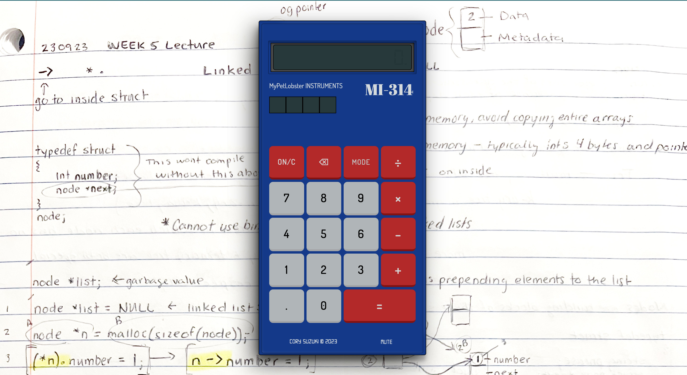

# Calculator - Odin Foundations

The <a href="https://www.theodinproject.com/lessons/foundations-calculator#solutions">assignment</a> was to create a calculator application using HTML, CSS, and JavaScript.

## My Process
- The first calculator that came to mind was the old ubiquitous blue and red calculator from middle school. I decided to use <a href="design/nostalgia-calc.jpg">that old calculator design</a> for inspiration.
- I also wanted my calculator to function much like those old calculators. I included the display dimming feature after a period of no button presses. I also included a little easter egg with the solar panel (if you know, you know).

Have fun.....doing math. lol

<a href="https://mypetlobster.github.io/calculator">Link to live preview of calculator</a>

## Snapshot of my calculator

